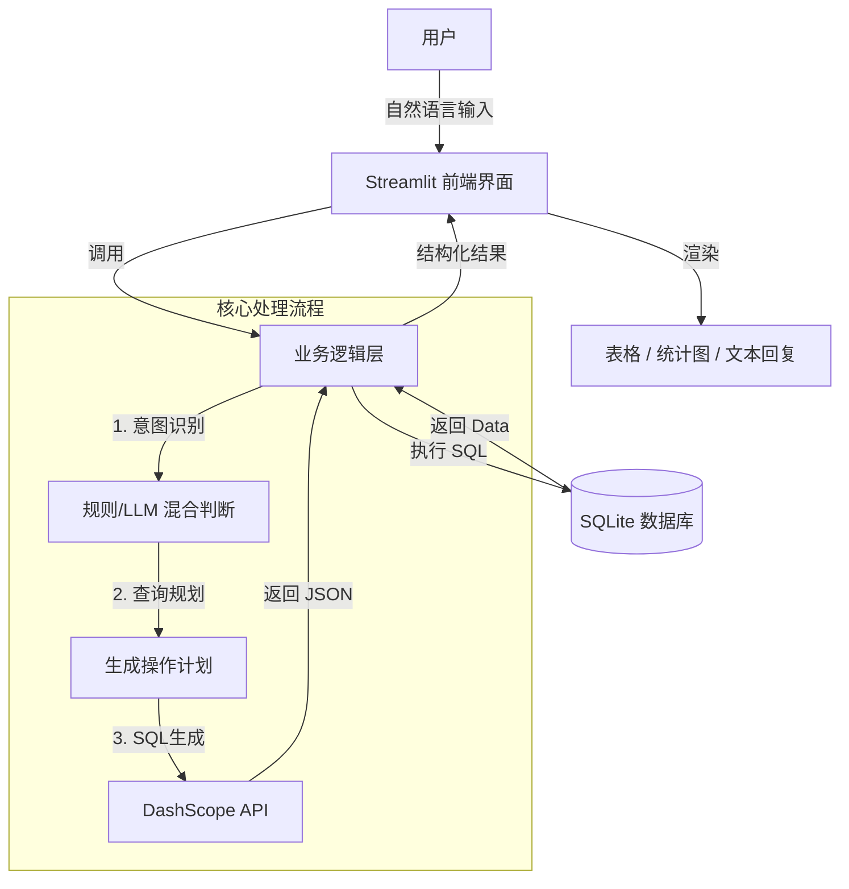

# 🎓 基于大语言模型的学生信息管理助手

> **项目状态**：✅ 已完成核心功能开发
> **技术栈**：Python + Streamlit + DashScope (通义千问) + SQLite + Pandas + Plotly

---

## 1. 项目概述

本项目旨在利用大语言模型（LLM）的自然语言理解能力，构建一个**零门槛、对话式**的学生信息管理系统。用户无需掌握 SQL 语句，只需通过自然语言（如“查询张三的信息”、“统计计算机学院人数”）即可完成复杂的数据库查询、统计与可视化操作。

### 1.1 团队分工
*   **前端与系统集成 (A)**：负责 `Streamlit` 界面搭建、会话状态管理 (`Session State`)、数据可视化 (`Plotly`) 以及与后端接口的对接。
*   **后端与算法逻辑 (B)**：负责 `Prompt Engineering`（提示词工程）、Text2SQL 逻辑实现、意图识别算法优化以及数据库设计。

### 1.2 系统架构



---

## 2. 模块说明

| 文件名 | 类型 | 说明 |
| :--- | :--- | :--- |
| **`app.py`** | **入口** | 程序的启动入口。负责 UI 渲染、聊天记录管理、处理用户输入并展示结果。 |
| **`database.py`** | **数据层** | 负责数据库连接、表结构初始化。内置数据生成器，可在数据库为空时自动生成测试数据。 |
| **`llm_interface.py`** | **逻辑层** | 核心业务逻辑。封装了 DashScope API 调用，实现了“意图识别 -> SQL 生成 -> 结果解析”的完整链路。 |
| **`charts.py`** | **视图层** | 封装了 `Plotly` 绘图逻辑。根据数据自动判断图表类型并生成交互式图表。 |
| **`chat_history_manager.py`** | **工具** | 负责将聊天记录持久化保存到 JSON 文件，支持多会话管理。 |

---

## 3. 后端开发文档

本部分主要说明 LLM 交互逻辑与接口规范，便于后续维护与二次开发。

### 3.1 Prompt 设计
所有与大模型交互的 Prompt 均位于 **`llm_interface.py`** 文件中。

*   **主 Prompt (`handle` 方法)**：定义了数据库结构、Few-Shot 示例和 JSON 输出规范。
*   **兜底 Prompt**：当主逻辑解析失败时的备用方案。

### 3.2 Text2SQL 规范
模型生成的 SQL 遵循 **SQLite** 语法，且限制只能操作 `students` 表。
*   **安全限制**：已在代码层拦截 `DROP`, `TRUNCATE` 等高危指令。
*   **查询规范**：模糊查询统一使用 `LIKE` 语法。

### 3.3 接口返回结构 (JSON)
LLM 模块返回严格的 JSON 格式，结构定义如下：

#### 1. 普通对话
```json
{
    "type": "chat",
    "message": "你好！我是你的学生助手，请问有什么可以帮您？"
}
```

#### 2. 数据库查询 (SELECT)
```json
{
    "type": "sql",
    "sql": "SELECT * FROM students WHERE name = '张三'",
    "response_type": "select",
    "explain": "已为您查询张三的信息"
}
```

#### 3. 统计与绘图 (COUNT / GROUP BY)
```json
{
    "type": "sql",
    "sql": "SELECT college, COUNT(*) as count FROM students GROUP BY college",
    "response_type": "count"
}
```
*注：前端检测到 `response_type: count` 时会自动调用绘图模块。*

#### 4. 数据变更 (INSERT / UPDATE)
```json
{
    "type": "sql",
    "sql": "UPDATE students SET phone='13800000000' WHERE name='张三'",
    "response_type": "select"
}
```
*注：修改操作会触发系统的“二次确认”机制，需用户确认后执行。*

---

## 4. 数据库设计

数据库采用 SQLite，文件名为 `students.db`。

**表名**：`students`

| 字段名 | 类型 | 说明 | 示例 |
| :--- | :--- | :--- | :--- |
| `id` | INTEGER | 主键，自增 | 1 |
| `student_id` | TEXT | 学号 | "202101001" |
| `name` | TEXT | 姓名 | "张三" |
| `class_name` | TEXT | 班级 | "软件2101班" |
| `college` | TEXT | 学院 | "计算机学院" |
| `major` | TEXT | 专业 | "软件工程" |
| `grade` | INTEGER | 年级 (入学年份) | 2021 |
| `gender` | TEXT | 性别 | "男" / "女" |
| `phone` | TEXT | 手机号 | "13812345678" |

---

## 5. 未来展望

1.  **多表关联**：
    *   扩展课程表 (`courses`) 和成绩表 (`scores`)，支持更复杂的学业数据分析。
2.  **多模态交互**：
    *   集成语音识别 (ASR) 与语音合成 (TTS) 模块，实现全语音交互。
3.  **推理能力增强**：
    *   引入 `LangChain` 或 `ReAct` 框架，提升处理复杂逻辑推理任务的能力。
4.  **权限管理**：
    *   增加用户鉴权模块，区分管理员与普通用户权限。
